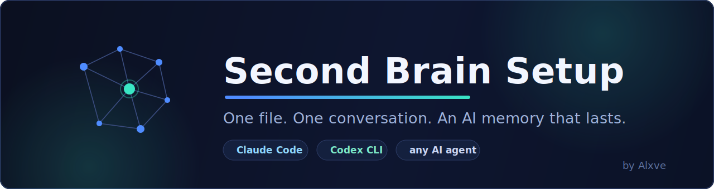
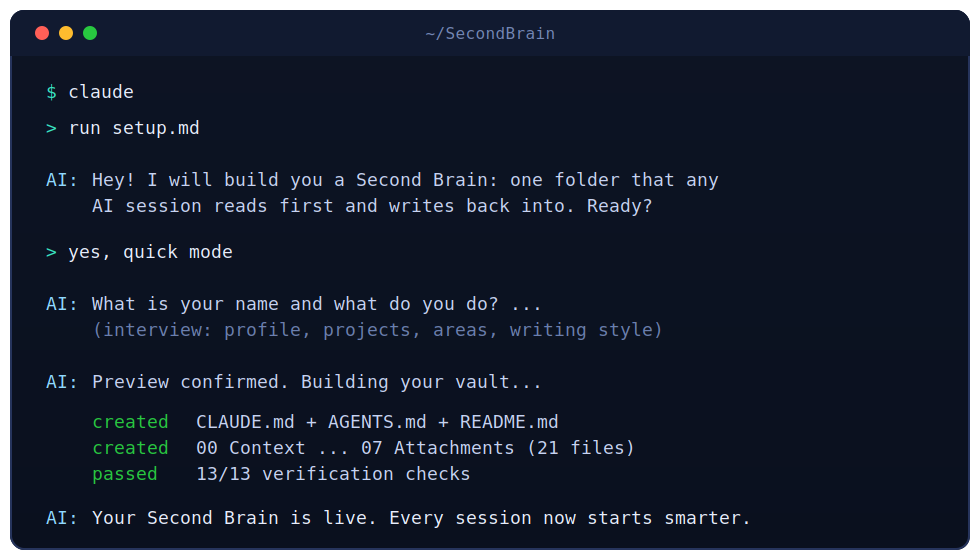
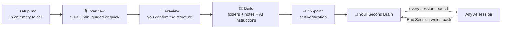

<a id="readme-top"></a>

<div align="center">



<br/>
<br/>

**Your AI forgets everything between sessions. This one file fixes that.**

[Quick Start](#-quick-start) · [What you get](#-what-you-get) · [Migration](#-already-have-notes) · [FAQ](#-faq)

<br/>

[](setup.md)
[](LICENSE)
[](setup.md)

[](https://docs.anthropic.com/en/docs/claude-code/overview)
[](https://developers.openai.com/codex/cli)
[](#-works-with)
[](#-quick-start)
[](#-quick-start)
[](#-quick-start)

</div>

<br/>

<details>
  <summary><b>📚 Table of contents</b></summary>
  <ol>
    <li><a href="#-highlights">Highlights</a></li>
    <li><a href="#-what-is-this">What is this?</a></li>
    <li><a href="#-how-it-works">How it works</a></li>
    <li><a href="#-quick-start">Quick Start</a></li>
    <li><a href="#-what-you-get">What you get</a></li>
    <li><a href="#-the-daily-loop">The daily loop</a></li>
    <li><a href="#-already-have-notes">Already have notes?</a></li>
    <li><a href="#-works-with">Works with</a></li>
    <li><a href="#-updating">Updating</a></li>
    <li><a href="#-safety">Safety</a></li>
    <li><a href="#-faq">FAQ</a></li>
    <li><a href="#-contributing">Contributing</a></li>
    <li><a href="#-license">License</a></li>
  </ol>
</details>

---

## ✨ Highlights

- 🗂️ **One file, zero dependencies** — drop `setup.md` in an empty folder, say `run setup.md`, done
- 🎙️ **Interview, not configuration** — the AI asks about your life and work, then builds a vault around *your* answers
- 🧠 **Memory that compounds** — every session reads your context first and writes decisions, learnings, and a daily log back
- 🤖 **Claude *and* Codex, same brain** — generates `CLAUDE.md`, `AGENTS.md`, and `README.md` as one synced instruction set
- 🧳 **Brings your old notes along** — opt-in, copy-first migration for existing vaults and notes (originals never touched)
- 🔚 **Ships its own `/end-session` skill** — the closeout that writes your daily log is generated right into the vault
- ✅ **Verifies itself** — the build isn't "done" until a 13-point check passes

<p align="right">(<a href="#readme-top">back to top</a>)</p>

## 🧠 What is this?

Every AI chat starts from zero. You explain your projects again, your style again, where you left off again. The context you build in one session dies with it.

**Second Brain Setup** turns one folder on your computer into a persistent memory for every AI tool you use. It is a *second brain* in the [PARA](https://fortelabs.com/blog/para/) spirit — projects, areas, resources, archive — plus standing AI instructions, so the very first thing any session does is remember who you are.

<div align="center">
  
</div>

<p align="right">(<a href="#readme-top">back to top</a>)</p>

## ⚙️ How it works



The setup interviews you in phases — who you are, how you work with AI today, your projects, ongoing areas, knowledge topics, writing style — previews the exact folder tree for your confirmation, and only then builds. Nothing is written before you say yes.

<p align="right">(<a href="#readme-top">back to top</a>)</p>

## 🚀 Quick Start

> [!TIP]
> Total time: about 20–30 minutes, most of it answering questions about yourself. There is a **quick mode** if you're in a hurry.

1. **Install an AI CLI** (skip if you have one):
   [Claude Code](https://docs.anthropic.com/en/docs/claude-code/overview) or [Codex CLI](https://developers.openai.com/codex/cli)

2. **Create an empty folder** where your Second Brain should live, and put [`setup.md`](setup.md) inside it:

   ```bash
   mkdir SecondBrain && cd SecondBrain
   # download setup.md into this folder
   ```

3. **Start your AI tool in that folder:**

   ```bash
   claude    # or: codex
   ```

4. **Say the magic words:**

   ```
   run setup.md
   ```

5. Answer the questions. Confirm the preview. Watch it build. **That's it.**

> [!NOTE]
> If `claude` or `codex` isn't found after installing, restart your terminal or follow the PATH instructions in the tool's install guide.

<p align="right">(<a href="#readme-top">back to top</a>)</p>

## 📦 What you get

A complete, personalized vault — this is the shape (your projects, areas, and topics replace the examples):

<details>
<summary><b>🌳 Click to expand the folder tree</b></summary>

```text
SecondBrain/
+-- CLAUDE.md            <- standing instructions, read by Claude Code
+-- AGENTS.md            <- identical twin, read by Codex
+-- README.md            <- identical twin + intro line, for any other agent
+-- .claude/skills/
|   +-- end-session/
|       +-- SKILL.md     <- the generated /end-session closeout skill
+-- 00 Context/
|   +-- About Me.md          <- who you are, how you work
|   +-- Writing Style.md     <- your tone, your rules
|   +-- Decisions.md         <- dated log of every decision
|   +-- Learnings.md         <- dated log of every lesson
+-- 01 Inbox/
|   +-- Brain Dump.md        <- throw thoughts here, AI sorts them
+-- 02 Projects/             <- things with a goal and an end
+-- 03 Areas/                <- ongoing responsibilities
+-- 04 Resources/            <- knowledge you collect
+-- 05 Daily Notes/          <- the memory between sessions
+-- 06 Archive/              <- finished work, searchable
+-- 07 Attachments/          <- images, PDFs, media
```

</details>

| Piece | What it does for you |
|---|---|
| 🤖 **Instruction files** | Claude, Codex, and any agent load the same rules, style, and context — automatically |
| 👤 **Context profile** | Your background, audience, style, and constraints, written as prose the AI actually uses |
| 📓 **Daily Notes** | Each session ends with a dated log: done, decided, open, next — the next session picks it up |
| 📥 **Inbox** | Zero-friction capture; sorting is the AI's job, not yours |
| 🗃️ **Decisions & Learnings** | Nothing important lives only in a chat scrollback anymore |
| 🔚 **`/end-session` skill** | One trigger wraps the session: daily note written, captures filed, optional commit |

<p align="right">(<a href="#readme-top">back to top</a>)</p>

## 🔁 The daily loop

This is where the compounding happens:

1. **Session start** — the AI reads your instruction file, checks the Inbox, and knows where you left off.
2. **During work** — decisions, learnings, and project progress are captured *as they happen*.
3. **"End Session"** — the vault's generated `/end-session` skill writes today's Daily Note (done, decided, open, next), checks that captures landed, and offers one clean commit.

> [!IMPORTANT]
> Saying **"End Session"** when you stop is 80% of the value. It's the habit that makes tomorrow's session smarter than today's.

<p align="right">(<a href="#readme-top">back to top</a>)</p>

## 🧳 Already have notes?

Setup asks whether you have an existing notes system, Obsidian vault, exported notes, or old `CLAUDE.md`/`AGENTS.md` files. Say **none** and the whole topic never comes up again. Give it paths and you get a careful, opt-in migration:

- 🔍 Read-only inventory first, then a **mapping table you confirm** before anything is copied
- 📋 **Copy-first** — originals are never moved, changed, or deleted
- 🔐 Secret filter — `.env` files, keys, tokens, and credential files are never copied
- 🧾 Batch manifest — an interrupted migration resumes without duplicates
- ✅ The full verification gate runs again after migration

<p align="right">(<a href="#readme-top">back to top</a>)</p>

## 🤝 Works with

| Tool | Instruction file | Status |
|---|---|---|
| [Claude Code](https://docs.anthropic.com/en/docs/claude-code/overview) | `CLAUDE.md` | ✅ auto-loaded |
| [Codex CLI](https://developers.openai.com/codex/cli) | `AGENTS.md` | ✅ auto-loaded |
| Any other capable agent | `README.md` | ✅ point it at the file |
| [Obsidian](https://obsidian.md) *(optional)* | — | ✅ pre-configured if you want it |

All three instruction files carry identical content and a built-in sync rule, so your brain never splits between tools.

<p align="right">(<a href="#readme-top">back to top</a>)</p>

## ⬆️ Updating

`setup.md` carries a version header. When a newer version ships, drop it into your vault and say **"upgrade"** — it only adds new rules and safety checks. It never rebuilds your vault and never touches your content.

Re-running setup on an existing vault is safe by design: every existing file is treated as **PROTECTED**, and any change needs a per-file yes with an automatic backup first.

<p align="right">(<a href="#readme-top">back to top</a>)</p>

## 🛡️ Safety

> [!WARNING]
> An onboarding file that builds folders on your machine should be paranoid. This one is.

- 🚫 Never deletes or overwrites existing content without an explicit per-file yes
- 🔒 Never writes passwords, API keys, tokens, or secrets into the vault — by standing rule
- 🧱 Nothing is built before you confirm the previewed structure
- 🗑️ Its own crash-recovery state file is cleaned up after a verified build
- 📴 Works fully offline-local: your vault is plain markdown files in a folder you own

<p align="right">(<a href="#readme-top">back to top</a>)</p>

## ❓ FAQ

<details>
<summary><b>Do I need Obsidian?</b></summary>
<br/>
No. Everything is plain markdown in plain folders. Obsidian is a nice free viewer for it, and setup pre-configures it if you say yes — but no tool besides your AI CLI is required.
</details>

<details>
<summary><b>Is my data sent anywhere?</b></summary>
<br/>
The vault is local files on your machine. Your AI tool reads them in its sessions the same way it reads any project folder — no extra service, no account, no telemetry from this project.
</details>

<details>
<summary><b>What if I stop in the middle of setup?</b></summary>
<br/>
Progress is saved to <code>setup-progress.md</code> after every phase. Next time you say <code>run setup.md</code>, it offers to resume exactly where you stopped.
</details>

<details>
<summary><b>Can I use a language other than English?</b></summary>
<br/>
Yes. The interview asks which language your vault should be written in — all generated files follow it.
</details>

<details>
<summary><b>What does it do on Windows vs. macOS vs. Linux?</b></summary>
<br/>
The setup detects your OS (WSL counts as Linux) and handles the differences itself — including cross-platform-safe file names for project titles like <code>Client A / Q3: Launch</code>.
</details>

<details>
<summary><b>Why three identical instruction files?</b></summary>
<br/>
Claude Code auto-loads <code>CLAUDE.md</code>, Codex auto-loads <code>AGENTS.md</code>, and neither can import the other. Three synced copies with a built-in parity rule is the only portable answer today — the vault's own rules keep them in lockstep.
</details>

<p align="right">(<a href="#readme-top">back to top</a>)</p>

## 🤲 Contributing

Ideas, fixes, and improvements are welcome:

1. 🐛 **Found a rough edge?** [Open an issue](https://github.com/Alxve99/second-brain-setup/issues) — describe what you ran, what you expected, and what happened
2. 🔧 **Have a fix or addition?** Fork the repo, edit `setup.md`, and open a pull request
3. 🧪 **Golden rule:** test your change by actually running the setup in an empty folder before submitting — this project's bar is a flawless first run

Since everything lives in one file, keep changes focused: one improvement per pull request, and bump the `Setup version` header only when asked.

<p align="right">(<a href="#readme-top">back to top</a>)</p>

## 📄 License

Distributed under the [MIT License](LICENSE).

<div align="center">
<br/>

**Built with care by [Alxve](https://github.com/Alxve99)** 🧠

*If this gave your AI a memory, a ⭐ helps others find it.*

</div>
